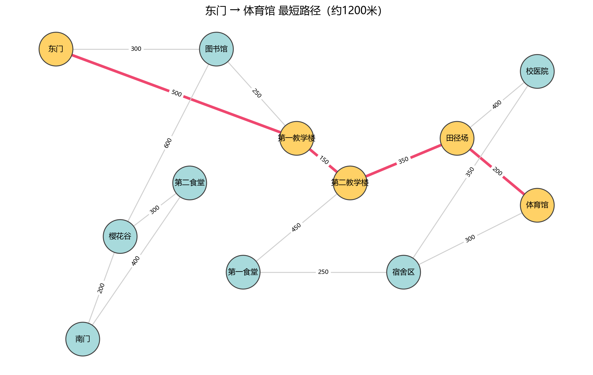

校园导览系统（Campus Guide）
基于图数据结构的校园导航系统：支持最短路径问路、景点评分筛选推荐与地图可视化。

功能
邻接矩阵图建模，管理 12 个景点、15 条路径，JSON 持久化存储
Dijkstra 最短路径查询（heapq 优先队列优化，O((V+E)logV)）
手写堆排序 + 折半查找，实现评分筛选与 Top-K 推荐
游客评分功能，评分实时写回文件
NetworkX + Matplotlib 地图可视化，查询路线高亮显示
pytest 单元测试覆盖核心算法（14 个用例）
运行
python campus_guide.py  主系统python campus_map.py  地图可视化

测试
python -m pytest test_campus_guide.py -v

截图

